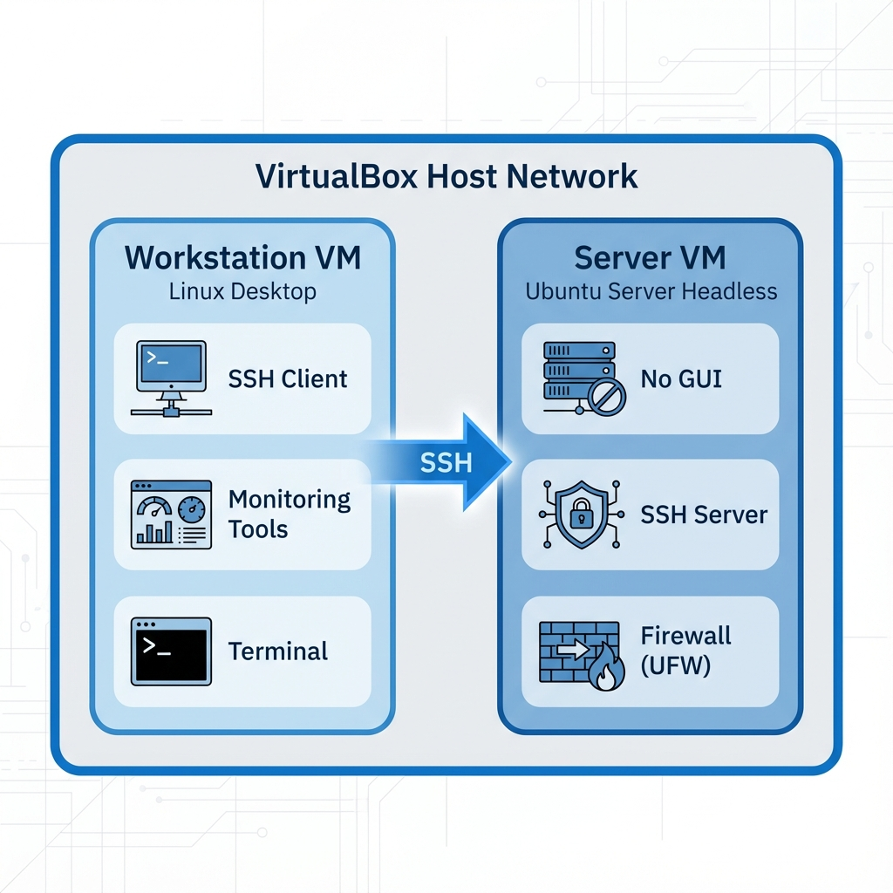
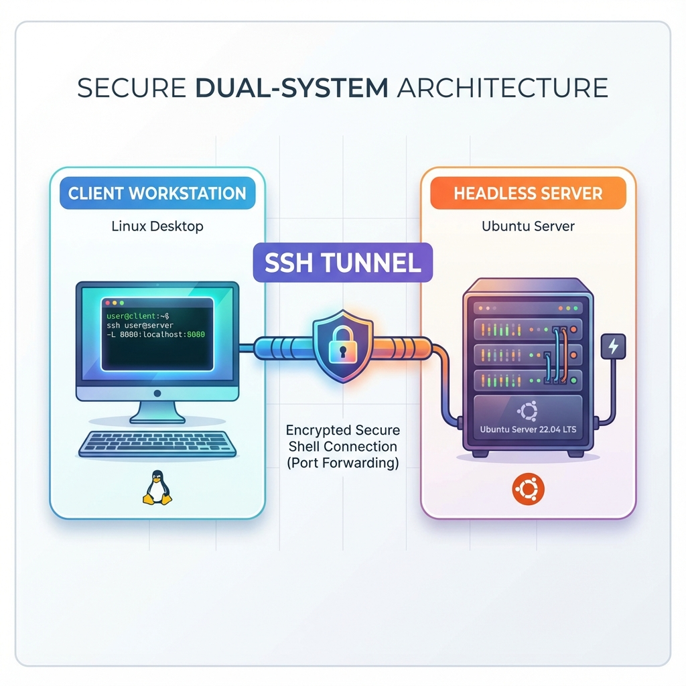
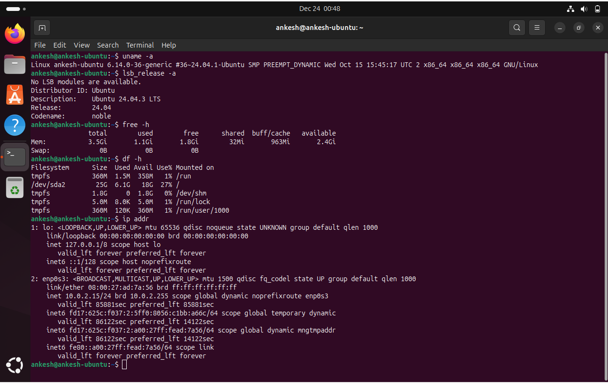

# Week 1: System Planning and Distribution Selection

**Phase 1** | [← Back to Index](index.md) | [Week 2 →](week2.md)

---

## Overview

This week focuses on planning the operating system deployment and making informed technical decisions about the system architecture, distribution selection, and network configuration.

---

## 1. System Architecture Diagram

### Dual-System Architecture



**Architecture Description:**
- **Workstation VM:** A Linux Desktop environment acting as the administrative console. It hosts SSH clients, monitoring tools, and terminal emulators.
- **Server VM:** A headless Ubuntu Server handling the core workloads. It is secured with UFW and accessible only via SSH.
- **Connection:** A dedicated SSH tunnel connects the workstation to the server within the virtual network.

---

## 2. Distribution Selection Justification

### Chosen Server Distribution: [Distribution Name]

**Comparison Matrix:**

| Criteria | Ubuntu Server | Debian | CentOS Stream | Rocky Linux |
|----------|---------------|--------|---------------|-------------|
| Stability | ⭐⭐⭐⭐ | ⭐⭐⭐⭐⭐ | ⭐⭐⭐ | ⭐⭐⭐⭐ |
| Documentation | ⭐⭐⭐⭐⭐ | ⭐⭐⭐⭐ | ⭐⭐⭐⭐ | ⭐⭐⭐ |
| Community Support | ⭐⭐⭐⭐⭐ | ⭐⭐⭐⭐ | ⭐⭐⭐ | ⭐⭐⭐ |
| Package Management | APT | APT | DNF | DNF |
| LTS Support | 5 years | Varies | Rolling | 10 years |
| Ease of Use | ⭐⭐⭐⭐⭐ | ⭐⭐⭐⭐ | ⭐⭐⭐ | ⭐⭐⭐ |

**Justification:**
- **Industry Standard:** Ubuntu Server is widely deployed in enterprise environments, making it a relevant choice for gaining improved employability skills.
- **Documentation & Support:** The extensive community documentation and "Ask Ubuntu" forums provide excellent troubleshooting resources for learning.
- **Hardware Compatibility:** Excellent driver support ensures smooth operation within the VirtualBox environment without complex configuration.

**Key Features:**
- **Long Term Support (LTS):** The 24.04 LTS release guarantees 5 years of security updates, ensuring system stability throughout the coursework.
- **Package Management:** The APT ecosystem offers a vast repository of pre-compiled binaries, simplifying the installation of monitoring tools and services.
- **Security Integration:** Native support for AppArmor and UFW allows for immediate implementation of mandatory access controls and firewall rules.

---

## 3. Workstation Configuration Decision

### Selected Workstation Option: [Option A/B/C]

**Available Options:**
- **Option A:** Linux Desktop VM (separate virtual machine)
- **Option B:** Host machine with SSH client
- **Option C:** Hybrid approach

**My Choice:** [Your choice]

**Justification:**
- [Reason 1]
- [Reason 2]
- [Reason 3]

**Configuration Details:**
- Operating System: [OS name and version]
- SSH Client: [Client software]
- Additional Tools: [List monitoring and admin tools]

---

## 4. Network Configuration Documentation

### VirtualBox Network Settings

**Network Mode:** [NAT Network / Host-Only / Bridged]

**Network Configuration:**
```
Server VM:
- Network Adapter: [Adapter type]
- IP Address: [Static IP]
- Subnet Mask: [Mask]
- Gateway: [Gateway IP]

Workstation VM:
- Network Adapter: [Adapter type]
- IP Address: [Static IP]
- Subnet Mask: [Mask]
- Gateway: [Gateway IP]
```

**Network Diagram:**


**Configuration Steps:**
1. [Step 1]
2. [Step 2]
3. [Step 3]

**Connectivity Testing:**
```bash
# Ping test from workstation to server
ping [server-ip]

# SSH connectivity test
ssh [username]@[server-ip]
```

---

## 5. CLI System Specifications

### Server System Specifications

**Command: `uname -a`**
```bash
[username]@[hostname]:~$ uname -a
[Output here]
```

**Command: `lsb_release -a`**
```bash
[username]@[hostname]:~$ lsb_release -a
[Output here]
```

**Command: `free -h`**
```bash
[username]@[hostname]:~$ free -h
              total        used        free      shared  buff/cache   available
Mem:          [data]       [data]      [data]    [data]    [data]       [data]
Swap:         [data]       [data]      [data]
```

**Command: `df -h`**
```bash
[username]@[hostname]:~$ df -h
Filesystem      Size  Used Avail Use% Mounted on
[Output here]
```

**Command: `ip addr`**
```bash
[username]@[hostname]:~$ ip addr
[Output here]
```

**Screenshot:**


---

## Learning Reflections

### What I Learned This Week
- [Key learning point 1]
- [Key learning point 2]
- [Key learning point 3]

### Challenges Encountered
- [Challenge 1 and how you addressed it]
- [Challenge 2 and how you addressed it]

### Next Steps
- Prepare for Phase 2: Security Planning and Testing Methodology
- Begin researching security hardening techniques
- Plan performance testing approach

---

## References

[1] [Reference in IEEE format]

[2] [Reference in IEEE format]

---

**Week 1 Completion Date:** [Date]  
**Time Spent:** [Hours]

[← Back to Index](index.md) | [Week 2 →](week2.md)
