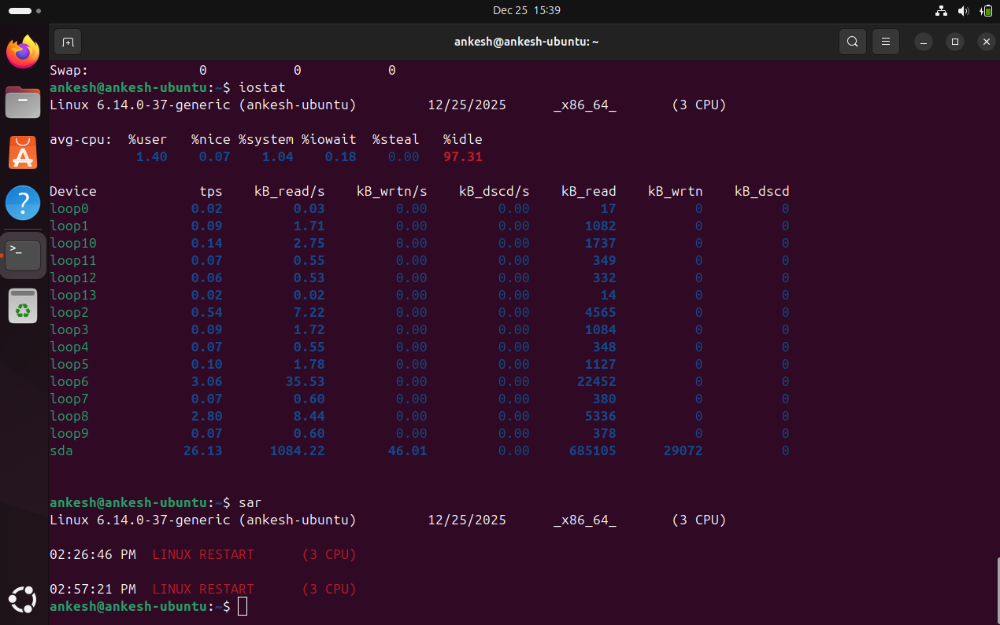

# Week 3: Application Selection for Performance Testing

**Phase 3** | [← Week 2](week2.md) | [Back to Index](index.md) | [Week 4 →](week4.md)

---

## Overview

This week focuses on selecting applications that represent different workload types for comprehensive performance evaluation. The selected applications will be used to test CPU, memory, disk I/O, and network performance characteristics.

---

## 1. Application Selection Matrix

### Selected Applications

| Application | Workload Type | Primary Resource | Justification | Expected Use Case |
|-------------|---------------|------------------|---------------|-------------------|
| **[App 1]** | CPU-Intensive | CPU | [Why chosen] | [Use case] |
| **[App 2]** | RAM-Intensive | Memory | [Why chosen] | [Use case] |
| **[App 3]** | I/O-Intensive | Disk | [Why chosen] | [Use case] |
| **[App 4]** | Network-Intensive | Network | [Why chosen] | [Use case] |
| **[App 5]** | Server Application | Mixed | [Why chosen] | [Use case] |

### Example Applications by Category

**CPU-Intensive Applications:**
- Compression tools (gzip, bzip2, xz)
- Video encoding (ffmpeg)
- Scientific computing (stress-ng with CPU workers)
- Cryptographic operations (openssl benchmarks)
- Compilation tasks (kernel compilation)

**RAM-Intensive Applications:**
- In-memory databases (Redis, Memcached)
- Large data processing
- Memory stress testing (stress-ng with memory workers)
- Virtual machines or containers

**I/O-Intensive Applications:**
- Database servers (MySQL, PostgreSQL)
- File servers
- Disk benchmarking tools (fio, dd)
- Log processing applications

**Network-Intensive Applications:**
- Web servers (Apache, Nginx)
- File transfer services (FTP, SFTP)
- Network benchmarking (iperf3)
- Game servers (Minecraft, CS:GO)

**Server Applications:**
- Minecraft server
- Web application stack (LAMP/LEMP)
- Docker containers
- Game servers

---

## 2. Detailed Application Profiles

### Application 1: [Name]

**Category:** [CPU/RAM/I/O/Network/Server]

**Description:**
[Detailed description of the application and its purpose]

**Justification for Selection:**
- [Reason 1]
- [Reason 2]
- [Reason 3]

**Installation Method:**
```bash
# Installation commands via SSH
[username]@[hostname]:~$ [command 1]
[username]@[hostname]:~$ [command 2]
```

**Configuration:**
```bash
# Configuration file location
[config file path]

# Key configuration parameters
[parameter 1]
[parameter 2]
```

**Testing Scenarios:**
1. [Scenario 1]
2. [Scenario 2]
3. [Scenario 3]

---

### Application 2: [Name]

**Category:** [CPU/RAM/I/O/Network/Server]

**Description:**
[Detailed description]

**Justification for Selection:**
- [Reason 1]
- [Reason 2]
- [Reason 3]

**Installation Method:**
```bash
[Installation commands]
```

**Configuration:**
```bash
[Configuration details]
```

**Testing Scenarios:**
1. [Scenario 1]
2. [Scenario 2]
3. [Scenario 3]

---

### Application 3: [Name]

**Category:** [CPU/RAM/I/O/Network/Server]

**Description:**
[Detailed description]

**Justification for Selection:**
- [Reason 1]
- [Reason 2]
- [Reason 3]

**Installation Method:**
```bash
[Installation commands]
```

**Configuration:**
```bash
[Configuration details]
```

**Testing Scenarios:**
1. [Scenario 1]
2. [Scenario 2]
3. [Scenario 3]

---

### Application 4: [Name]

**Category:** [CPU/RAM/I/O/Network/Server]

**Description:**
[Detailed description]

**Justification for Selection:**
- [Reason 1]
- [Reason 2]
- [Reason 3]

**Installation Method:**
```bash
[Installation commands]
```

**Configuration:**
```bash
[Configuration details]
```

**Testing Scenarios:**
1. [Scenario 1]
2. [Scenario 2]
3. [Scenario 3]

---

### Application 5: [Name]

**Category:** [CPU/RAM/I/O/Network/Server]

**Description:**
[Detailed description]

**Justification for Selection:**
- [Reason 1]
- [Reason 2]
- [Reason 3]

**Installation Method:**
```bash
[Installation commands]
```

**Configuration:**
```bash
[Configuration details]
```

**Testing Scenarios:**
1. [Scenario 1]
2. [Scenario 2]
3. [Scenario 3]

---

## 3. Installation Documentation

### SSH-Based Installation Process

**General Installation Workflow:**
1. Connect to server via SSH from workstation
2. Update package repositories
3. Install application packages
4. Configure application settings
5. Start and enable services
6. Verify installation
7. Test basic functionality

**Standard Commands:**
```bash
# Connect to server
workstation$ ssh [username]@[server-ip]

# Update repositories
[username]@server:~$ sudo apt update

# Install application
[username]@server:~$ sudo apt install [package-name] -y

# Check service status
[username]@server:~$ sudo systemctl status [service-name]

# Enable service to start on boot
[username]@server:~$ sudo systemctl enable [service-name]

# Start service
[username]@server:~$ sudo systemctl start [service-name]
```

**Installation Screenshots:**


**Verification Commands:**
```bash
# Verify installation
[username]@server:~$ which [application]
[username]@server:~$ [application] --version

# Check running processes
[username]@server:~$ ps aux | grep [application]

# Check listening ports
[username]@server:~$ sudo ss -tulpn | grep [port]
```

---

## 4. Expected Resource Profiles

### Baseline Resource Usage

**Application 1: [Name]**
- **CPU Usage:** [Expected %]
- **Memory Usage:** [Expected MB/GB]
- **Disk I/O:** [Expected MB/s]
- **Network:** [Expected Mbps]
- **Processes:** [Expected count]

**Application 2: [Name]**
- **CPU Usage:** [Expected %]
- **Memory Usage:** [Expected MB/GB]
- **Disk I/O:** [Expected MB/s]
- **Network:** [Expected Mbps]
- **Processes:** [Expected count]

**Application 3: [Name]**
- **CPU Usage:** [Expected %]
- **Memory Usage:** [Expected MB/GB]
- **Disk I/O:** [Expected MB/s]
- **Network:** [Expected Mbps]
- **Processes:** [Expected count]

**Application 4: [Name]**
- **CPU Usage:** [Expected %]
- **Memory Usage:** [Expected MB/GB]
- **Disk I/O:** [Expected MB/s]
- **Network:** [Expected Mbps]
- **Processes:** [Expected count]

**Application 5: [Name]**
- **CPU Usage:** [Expected %]
- **Memory Usage:** [Expected MB/GB]
- **Disk I/O:** [Expected MB/s]
- **Network:** [Expected Mbps]
- **Processes:** [Expected count]

### Resource Profile Comparison Chart

```
Resource Usage Expectations
━━━━━━━━━━━━━━━━━━━━━━━━━━━━━━━━━━━━━━━━━━━━━━━━━━━━━━━━━━━━━━━━━━━━
Application    CPU    Memory    Disk I/O    Network    Overall Load
━━━━━━━━━━━━━━━━━━━━━━━━━━━━━━━━━━━━━━━━━━━━━━━━━━━━━━━━━━━━━━━━━━━━
App 1          ████   ██        █           █          High CPU
App 2          ██     █████     █           █          High RAM
App 3          ██     ██        █████       █          High I/O
App 4          ██     ██        █           █████      High Network
App 5          ███    ███       ███         ███        Balanced
━━━━━━━━━━━━━━━━━━━━━━━━━━━━━━━━━━━━━━━━━━━━━━━━━━━━━━━━━━━━━━━━━━━━
```

---

## 5. Monitoring Strategy

### Per-Application Monitoring Approach

**Monitoring Tools Selection:**
- **Real-time monitoring:** `htop`, `iotop`, `iftop`
- **Historical data:** Custom monitoring script
- **System metrics:** `vmstat`, `iostat`, `mpstat`
- **Network metrics:** `ss`, `netstat`, `iperf3`

### Monitoring Script Design

**Script Purpose:**
Create a remote monitoring script (`monitor-server.sh`) that runs on the workstation, connects to the server via SSH, and collects performance metrics.

**Metrics to Collect:**
1. CPU usage per application
2. Memory consumption
3. Disk read/write rates
4. Network throughput
5. Process count
6. System load averages

**Data Collection Frequency:**
- Real-time: Every 1 second during active testing
- Historical: Every 5 minutes for baseline
- Logs: Continuous for anomaly detection

**Data Storage Format:**
```
timestamp,application,cpu_percent,memory_mb,disk_read_mb,disk_write_mb,network_rx_mb,network_tx_mb
```

### Measurement Methodology

**For Each Application:**

1. **Baseline Measurement** (No load)
   - Measure idle system resources
   - Record for 5 minutes
   - Calculate averages

2. **Application Startup**
   - Monitor resource spike during initialization
   - Record startup time
   - Note initial resource allocation

3. **Steady-State Operation**
   - Monitor normal operation
   - Record for 10 minutes
   - Identify resource patterns

4. **Load Testing**
   - Apply increasing load
   - Monitor resource scaling
   - Identify bottlenecks

5. **Peak Load**
   - Push to maximum capacity
   - Monitor system behavior
   - Record failure points (if any)

**Screenshot Examples:**


---

## Testing Timeline

| Day | Activity | Applications |
|-----|----------|--------------|
| 1 | Install App 1 & 2 | [Names] |
| 2 | Install App 3 & 4 | [Names] |
| 3 | Install App 5 | [Name] |
| 4 | Baseline testing | All apps |
| 5 | Verify monitoring | All apps |

---

## Learning Reflections

### What I Learned This Week
- [Key learning point 1]
- [Key learning point 2]
- [Key learning point 3]

### Challenges Encountered
- [Challenge 1 and solution]
- [Challenge 2 and solution]

### Application Selection Insights
- [Insight about workload diversity]
- [Insight about resource profiling]

### Next Steps
- Begin Phase 4: Initial System Configuration
- Implement SSH key-based authentication
- Configure firewall rules
- Create administrative user

---

## References

[1] [Reference in IEEE format]

[2] [Reference in IEEE format]

[3] [Reference in IEEE format]

---

**Week 3 Completion Date:** [Date]  
**Time Spent:** [Hours]

[← Week 2](week2.md) | [Back to Index](index.md) | [Week 4 →](week4.md)
