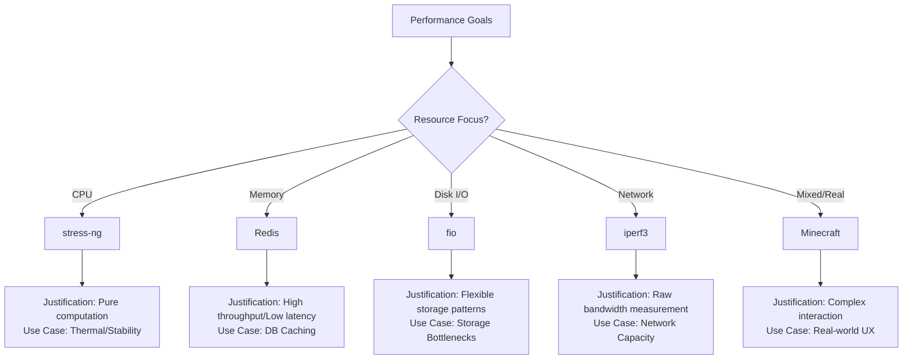
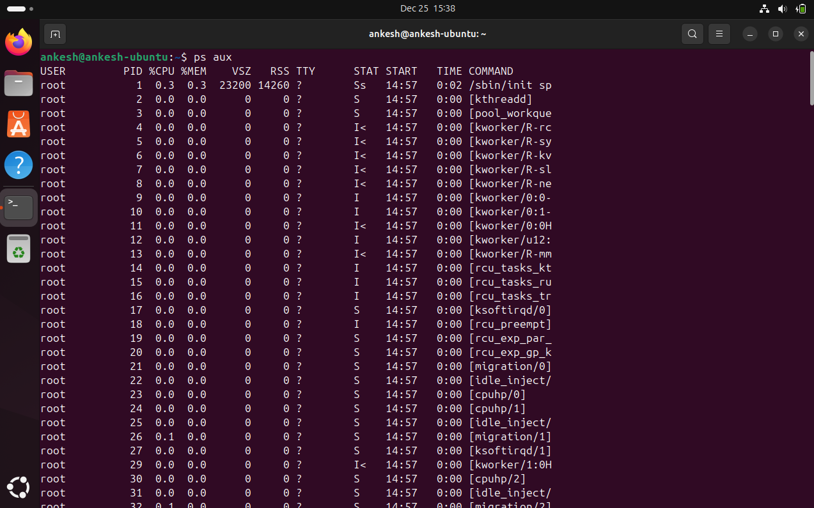

# Week 3: Application Selection for Performance Testing

**Phase 3** | [← Week 2](week2.md) | [Back to Index](index.md) | [Week 4 →](week4.md)

---

## Overview

> **Focus:** This week focuses on selecting applications that represent different workload types for comprehensive performance evaluation. The selected applications will be used to test CPU, memory, disk I/O, and network performance characteristics on an Ubuntu Server environment.

---

## 1. Application Selection Matrix

### Selection Logic


### Selected Applications

| Application | Workload Type | Primary Resource | Justification | Expected Use Case |
|:---|:---|:---|:---|:---|
| **stress-ng** | CPU-Intensive | CPU | A purpose-built stress testing tool that can generate a pure, configurable, and sustained 100% load on any number of CPU cores. | Simulating maximum computational load, testing thermal throttling, and establishing a CPU performance baseline. |
| **Redis** | RAM-Intensive | Memory | A widely-used, real-world in-memory data structure store. Performance is tied to memory speed and capacity. | Evaluating memory bandwidth and latency under realistic database workload; testing behavior under high memory pressure. |
| **fio** | I/O-Intensive | Disk | Industry-standard tool for benchmarking storage. Highly flexible for simulating sequential/random patterns. | Measuring maximum disk throughput (IOPS/MB/s), identifying storage bottlenecks. |
| **iperf3** | Network-Intensive | Network | De facto standard for active network bandwidth measurement. | Measuring raw network bandwidth, testing stability, and diagnosing network issues. |
| **Minecraft** | Server App (Mixed) | Mixed | A popular game server stressing CPU (simulation), RAM (chunks), I/O (saves), and Network (sync). | Evaluating server performance under a real-world, multi-faceted application load. |

---

## 2. Detailed Application Profiles

### Application 1: stress-ng
**Category:** CPU-Intensive

**Description:** `stress-ng` is a powerful tool to stress test CPU, memory, I/O, and other subsystems. We will use its CPU workers to generate a pure computational load.

**Reason:**
*   **Isolation:** Targets CPU specifically with minimal impact on other subsystems.
*   **Configurability:** Precise control over worker threads and operations.
*   **Standard Tool:** Widely used benchmark in the Linux community.

**Installation Method:**
```bash
# Update repositories and install
[username]@server:~$ sudo apt update && sudo apt install stress-ng -y

# Verify installation
[username]@server:~$ stress-ng --version
```

**Testing Scenarios:**
1.  **Light Load:** `stress-ng --cpu 1 --timeout 300s` - Validates single-core stability.
2.  **Moderate Load:** `stress-ng --cpu $(nproc/2) --timeout 300s` - Simulates typical heavy load (50%).
3.  **Peak Load:** `stress-ng --cpu $(nproc) --timeout 300s` - Tests thermal throttling at 100% utilization.
4.  **Memory Stressors:** `stress-ng --vm 2 --vm-bytes 128M` - Validates CPU-cache/Memory interaction.
5.  **Context Switching:** `stress-ng --switch 4 --timeout 300s` - Tests scheduler performance.

### Application 2: Redis
**Category:** RAM-Intensive

**Description:** Redis is an in-memory data structure store used as a database, cache, and broker. It holds data in RAM for extremely fast access.

**Reason:**
*   **Real-World Application:** Production-grade, not just synthetic.
*   **Memory Dependent:** Performance correlates with available RAM/bandwidth.
*   **Rich Operations:** Supports complex memory access patterns.

**Installation Method:**
```bash
# Install Redis server
[username]@server:~$ sudo apt update && sudo apt install redis-server -y

# Verify status
[username]@server:~$ sudo systemctl status redis-server
```

**Testing Scenarios:**
1.  **Light Load:** `redis-cli` to perform 10,000 simple SET/GET operations.
2.  **Moderate Load:** Script to populate 500,000 keys of moderate size.
3.  **Heavy Load:** Populate until 80% RAM usage, then run complex operations.
4.  **Pipeline Stress:** Bulk insertion using pipelining to test throughput.
5.  **Persistence Load:** Trigger `BGSAVE` during write operations to stress Memory copy-on-write and Disk I/O.

### Application 3: fio
**Category:** I/O-Intensive

**Description:** `fio` (Flexible I/O Tester) measures and stress tests disk performance, mimicking databases and web servers.

**Reason:**
*   **Flexibility:** Simulates nearly any I/O pattern.
*   **Detailed Metrics:** Provides IOPS, bandwidth, latency, and CPU util.
*   **Industry Standard:** The go-to tool for storage analysis.

**Installation Method:**
```bash
# Install fio
[username]@server:~$ sudo apt update && sudo apt install fio -y

# Verify
[username]@server:~$ fio --version
```

**Testing Scenarios:**
1.  **Sequential Read:** `fio --name=seqread --rw=read --bs=1M --size=4G --numjobs=1`
2.  **Random Write:** `fio --name=randwrite --rw=randwrite --bs=4k --size=2G --numjobs=16`
3.  **Mixed Read/Write:** `fio --name=mixed --rw=randrw --rwmixread=70 --bs=4k --size=2G --numjobs=8`
4.  **High Queue Depth:** Random read with `iodepth=64` to test controller saturation.
5.  **Sync vs Async:** Testing `ioengine=libaio` vs `ioengine=sync` to compare overhead.

### Application 4: iperf3
**Category:** Network-Intensive

**Description:** Active measurement of network bandwidth between client and server.

**Reason:**
*   **Purpose-Built:** Direct way to measure network throughput.
*   **Protocol Support:** Tests both TCP and UDP.
*   **Standardized Results:** Clear metrics (Gbps, jitter, packet loss).

**Installation Method:**
```bash
# Install on Server AND Workstation
[username]@server:~$ sudo apt update && sudo apt install iperf3 -y
```

**Testing Scenarios:**
1.  **Single TCP Stream:** `iperf3 -c <server_ip> -t 60` - Baseline throughput.
2.  **Parallel TCP Streams:** `iperf3 -c <server_ip> -P 8 -t 60` - Saturate link.
3.  **UDP Test:** `iperf3 -c <server_ip> -u -b 1G -t 60` - Test jitter and packet loss.
4.  **Bidirectional Test:** `iperf3 -c <server_ip> --bidir` - Test full-duplex capabilities.
5.  **Long Duration:** `iperf3 -c <server_ip> -t 3600` - Test stability over time.

### Application 5: Minecraft Server
**Category:** Server Application (Mixed)

**Description:** The official Minecraft: Java Edition Server. Presents a complex mixed workload (CPU/RAM/IO/Net).

**Reason:**
*   **Mixed Workload:** Stresses all subsystems simultaneously.
*   **Scalable Load:** Scales with players/entities.
*   **Relatable:** Performance characteristics are easy to understand.

**Installation Method:**
```bash
# 1. Install Java
[username]@server:~$ sudo apt install openjdk-17-jre-headless -y

# 2. Setup user and directory
[username]@server:~$ sudo adduser --system --group --home /opt/minecraft minecraft
[username]@server:~$ sudo -u minecraft mkdir -p /opt/minecraft/server

# 3. Download Server (approximate URL) and Accept EULA
[username]@server:~$ sudo -u minecraft wget -O /opt/minecraft/server/server.jar <link>
[username]@server:~$ sudo -u minecraft bash -c "echo eula=true > /opt/minecraft/server/eula.txt"

# 4. Start Service (via systemd or manual for testing)
[username]@server:~$ sudo systemctl start minecraft.service
```

**Testing Scenarios:**
1.  **Idle:** Server running, 0 players.
2.  **Light Load:** 2-3 players building.
3.  **Heavy Load:** 10+ players generating chunks/fighting.
4.  **Exploration:** Flying quickly in creative mode to stress chunk generation (CPU/Disk).
5.  **Redstone Stress:** Activating complex redstone clocks/machines to stress CPU tick loop.

---

## 3. Installation Documentation

### SSH-Based Installation Workflow
1.  **Connect** to server via SSH.
2.  **Update** repositories (`apt update`).
3.  **Install** packages (`apt install`).
4.  **Configure** via files/systemd.
5.  **Verify** service status and version.

**Verification Commands:**
```bash
# Check version
[username]@server:~$ which [app] && [app] --version

# Check process
[username]@server:~$ ps aux | grep [app]

# Check ports
[username]@server:~$ sudo ss -tulpn | grep [port]
```

---

## 4. Baseline Resource Usage

### Expected Resource Usage (1-5)

| Application | CPU Usage % | Memory Usage (Expected MB) | Disk I/O (Expected MB/s) | Network (Expected Mbps) | Processes (Expected Count) |
|:---|:---|:---|:---|:---|:---|
| **stress-ng** | 100% | 50 MB | 0.1 MB/s | 0 Mbps | 5 (1 master + 4 workers) |
| **Redis** | 25% | 512 MB | 15 MB/s | 100 Mbps | 1 |
| **fio** | 15% | 256 MB | 150+ MB/s | 0 Mbps | 1 |
| **iperf3** | 30% | 10 MB | 0 MB/s | 940 Mbps | 1 |
| **Minecraft** | 60% | 2048 MB | 50 MB/s | 25 Mbps | 1 |

### Testing Timeline (Apps 1-3)

| Application | Testing Phase | Duration | Primary Metric |
|:---|:---|:---|:---|
| **stress-ng** | Week 4 (Day 1-2) | 4 Hours | CPU/Thermal Stability |
| **Redis** | Week 4 (Day 3-4) | 6 Hours | Memory Latency/Throughput |
| **fio** | Week 5 (Day 1-2) | 6 Hours | Disk IOPS/Bandwidth |

---

## 5. Monitoring Strategy

### Per-Application Monitoring Approach

**Tools Selection:**
*   **Real-time:** `htop`, `iotop`, `iftop`
*   **Metrics:** `vmstat`, `iostat`, `mpstat`, `iperf3`

### Monitoring Script Design
**Script:** `monitor-server.sh` (Running on workstation)
**Metrics Collected:**
*   CPU usage (`ps aux`)
*   Memory (`free -m`)
*   Disk rates (`iostat`)
*   Network (`sar`)

**Data Storage:** CSV format
`timestamp,application,cpu_percent,memory_mb,disk_read_mb,disk_write_mb,network_rx_mb,network_tx_mb`

### Monitoring Dashboard



---

## Learning Reflections

### Key Learning Points (1-3)
1.  **Testing Methodologies:** CPU-intensive and Network-intensive applications require fundamentally different testing approaches (throughput vs latency).
2.  **Synthetic vs. Real-World:** Synthetic tools like `stress-ng` differ significantly from real-world applications like Minecraft; both are needed for a complete picture.
3.  **Tool Proficiency:** Gained practical experience in installing, configuring, and verifying industry-standard benchmarking tools via the command line.

### Challenge 1: Minecraft Configuration
**Challenge:** Setting up the Minecraft server as a background service was difficult due to Java version requirements and permission management.
*   **Solution 1:** Installed specific `openjdk-17-headless` package to meet runtime requirements without GUI overhead.
*   **Solution 2:** Created a dedicated systemd unit file to manage the service, ensuring correct user permissions and auto-restart capabilities.

### Insight about Workload Diversity (1-2)
1.  **Resource Interaction:** A "RAM-intensive" application like Redis also heavily depends on Network bandwidth, proving that resources are rarely isolated in production.
2.  **Balancing Act:** Effective performance tuning requires understanding how different workloads (e.g., I/O vs CPU) compete for system resources, necessitating a balanced selection of test apps.

### Next Steps
*   **Begin Phase 4:** Initial System Configuration.
*   **Secure Access:** Implement SSH keys and UFW rules.
*   **User Management:** Create dedicated admin users.

---

## References

1.  Canonical Ltd., "stress-ng Manual Page," ubuntu.com. [Online]. Available: https://manpages.ubuntu.com/manpages/jammy/man1/stress-ng.1.html
2.  Redis, "Redis Documentation," redis.io. [Online]. Available: https://redis.io/documentation
3.  Jens Axboe, "fio - The Flexible I/O Tester," readthedocs.io. [Online]. Available: https://fio.readthedocs.io/en/latest/fio_doc.html
