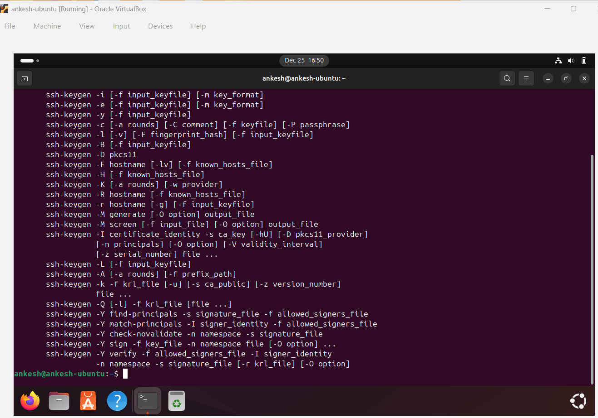
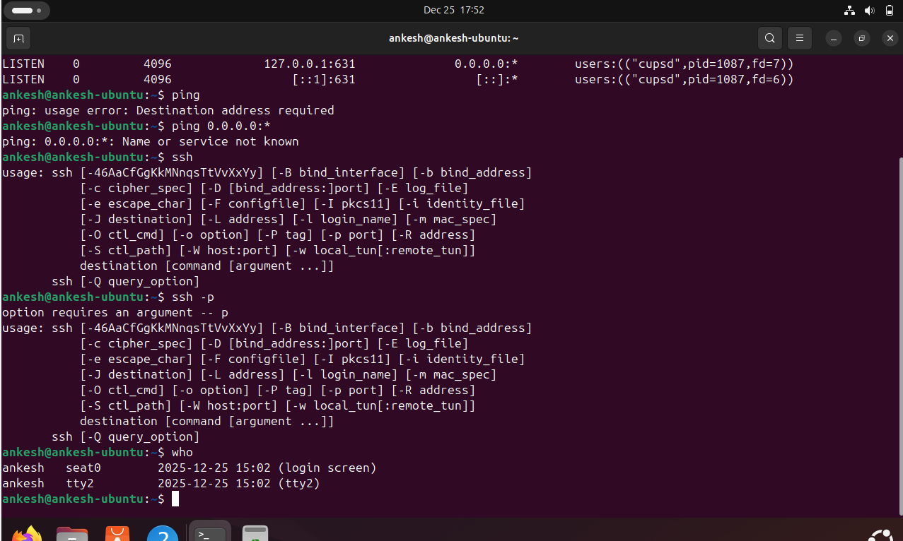
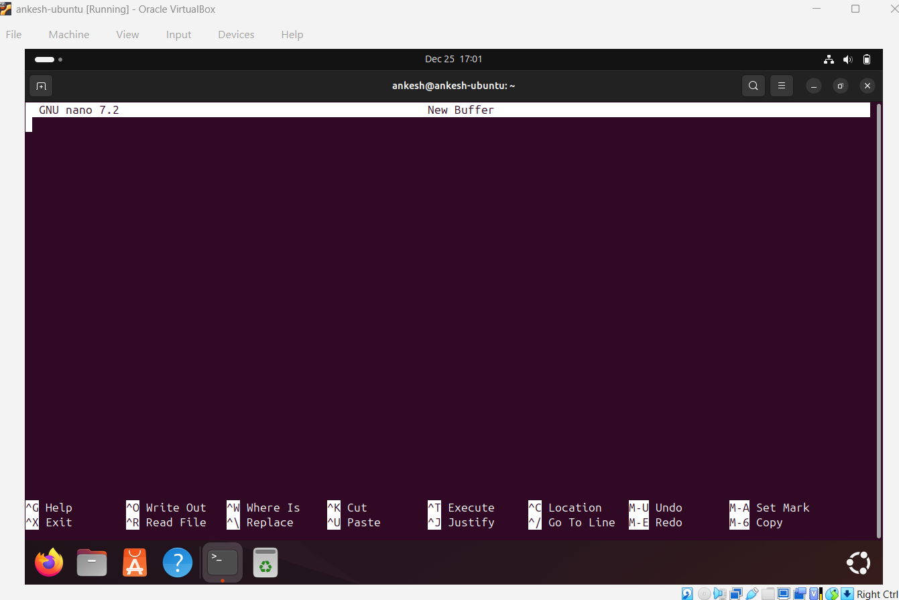
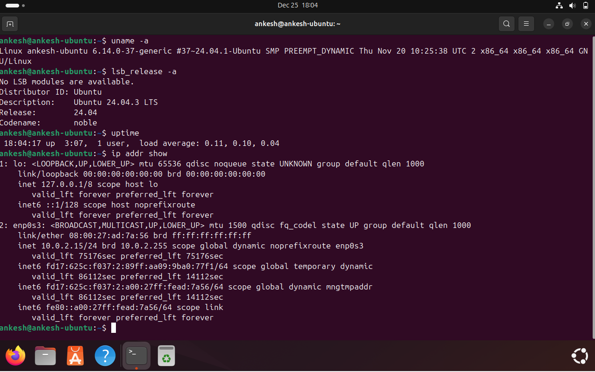

# Week 4: Initial System Configuration & Security Implementation

**Phase 4** | [← Week 3](week3.md) | [Back to Index](index.md) | [Week 5 →](week5.md)

---

## Overview

This week marks the beginning of hands-on implementation. The focus is on deploying the server and implementing foundational security controls including SSH key-based authentication, firewall configuration, and user privilege management.

**⚠️ Important:** All server configurations must be performed via SSH from the workstation.

---

## 1. SSH Key-Based Authentication

### Implementation Steps

**Step 1: Generate SSH Key Pair (on Workstation)**
```bash
workstation$ ssh-keygen -t ed25519 -C "your_email@example.com"
Generating public/private ed25519 key pair.
Enter file in which to save the key (/home/user/.ssh/id_ed25519): 
Enter passphrase (empty for no passphrase): 
Enter same passphrase again: 
Your identification has been saved in /home/user/.ssh/id_ed25519
Your public key has been saved in /home/user/.ssh/id_ed25519.pub
```

**Step 2: Copy Public Key to Server**
```bash
workstation$ ssh-copy-id [username]@[server-ip]
/usr/bin/ssh-copy-id: INFO: attempting to log in with the new key(s)
Number of key(s) added: 1
```

**Step 3: Test Key-Based Authentication**
```bash
workstation$ ssh [username]@[server-ip]
Welcome to Ubuntu [version]
Last login: [timestamp]
[username]@server:~$ 
```

**Step 4: Disable Password Authentication**
```bash
[username]@server:~$ sudo nano /etc/ssh/sshd_config

# Modify these lines:
PasswordAuthentication no
ChallengeResponseAuthentication no
PubkeyAuthentication yes
```

**Step 5: Restart SSH Service**
```bash
[username]@server:~$ sudo systemctl restart sshd
[username]@server:~$ sudo systemctl status sshd
```

### Configuration Evidence

**Before Configuration:**
```bash
# /etc/ssh/sshd_config (relevant sections)
#PasswordAuthentication yes
#PubkeyAuthentication yes
```

**After Configuration:**
```bash
# /etc/ssh/sshd_config (relevant sections)
PasswordAuthentication no
PubkeyAuthentication yes
ChallengeResponseAuthentication no
PermitRootLogin no
```

**Screenshots:**



---

## 2. Firewall Configuration

### UFW (Uncomplicated Firewall) Setup

**Step 1: Install UFW**
```bash
[username]@server:~$ sudo apt update
[username]@server:~$ sudo apt install ufw -y
```

**Step 2: Configure Default Policies**
```bash
[username]@server:~$ sudo ufw default deny incoming
[username]@server:~$ sudo ufw default allow outgoing
```

**Step 3: Allow SSH from Workstation Only**
```bash
[username]@server:~$ sudo ufw allow from [workstation-ip] to any port 22
Rule added
```

**Step 4: Enable Firewall**
```bash
[username]@server:~$ sudo ufw enable
Command may disrupt existing ssh connections. Proceed with operation (y|n)? y
Firewall is active and enabled on system startup
```

**Step 5: Verify Firewall Rules**
```bash
[username]@server:~$ sudo ufw status verbose
Status: active
Logging: on (low)
Default: deny (incoming), allow (outgoing), disabled (routed)
New profiles: skip

To                         Action      From
--                         ------      ----
22                         ALLOW IN    [workstation-ip]
```

### Complete Firewall Ruleset

```bash
[username]@server:~$ sudo ufw status numbered
Status: active

     To                         Action      From
     --                         ------      ----
[ 1] 22                         ALLOW IN    [workstation-ip]
```

### Firewall Testing

**Test 1: SSH from Workstation (Should Succeed)**
```bash
workstation$ ssh [username]@[server-ip]
# Connection successful
```

**Test 2: SSH from Another IP (Should Fail)**
```bash
other-machine$ ssh [username]@[server-ip]
# Connection timeout or refused
```

**Screenshots:**


---

## 3. User and Privilege Management

### Creating Non-Root Administrative User

**Step 1: Create New User**
```bash
[username]@server:~$ sudo adduser adminuser
Adding user `adminuser' ...
Adding new group `adminuser' (1001) ...
Adding new user `adminuser' (1001) with group `adminuser' ...
Creating home directory `/home/adminuser' ...
Copying files from `/etc/skel' ...
New password: 
Retype new password: 
passwd: password updated successfully
```

**Step 2: Add User to Sudo Group**
```bash
[username]@server:~$ sudo usermod -aG sudo adminuser
[username]@server:~$ groups adminuser
adminuser : adminuser sudo
```

**Step 3: Configure Sudo Access**
```bash
[username]@server:~$ sudo visudo

# Add this line:
adminuser ALL=(ALL:ALL) ALL
```

**Step 4: Set Up SSH Key for New User**
```bash
[username]@server:~$ sudo mkdir -p /home/adminuser/.ssh
[username]@server:~$ sudo cp ~/.ssh/authorized_keys /home/adminuser/.ssh/
[username]@server:~$ sudo chown -R adminuser:adminuser /home/adminuser/.ssh
[username]@server:~$ sudo chmod 700 /home/adminuser/.ssh
[username]@server:~$ sudo chmod 600 /home/adminuser/.ssh/authorized_keys
```

**Step 5: Test New User Access**
```bash
workstation$ ssh adminuser@[server-ip]
adminuser@server:~$ sudo whoami
[sudo] password for adminuser: 
root
```

### User Account Security

**Password Policy Configuration:**
```bash
[username]@server:~$ sudo nano /etc/login.defs

# Key settings:
PASS_MAX_DAYS   90
PASS_MIN_DAYS   1
PASS_MIN_LEN    12
PASS_WARN_AGE   7
```

**Account Lockout Policy:**
```bash
[username]@server:~$ sudo nano /etc/pam.d/common-auth

# Add this line:
auth required pam_tally2.so deny=5 unlock_time=900
```

### Principle of Least Privilege

**Disabled Accounts:**
```bash
[username]@server:~$ sudo usermod -L [unnecessary-user]
[username]@server:~$ sudo usermod -s /usr/sbin/nologin [service-user]
```

**Active Users List:**
```bash
[username]@server:~$ cat /etc/passwd | grep -v nologin | grep -v false
root:x:0:0:root:/root:/bin/bash
[username]:x:1000:1000::/home/[username]:/bin/bash
adminuser:x:1001:1001::/home/adminuser:/bin/bash
```

---

## 4. SSH Access Evidence

### Successful SSH Connection

**Connection from Workstation:**
```bash
workstation$ ssh adminuser@[server-ip]
Welcome to Ubuntu 22.04.3 LTS (GNU/Linux 5.15.0-91-generic x86_64)

 * Documentation:  https://help.ubuntu.com
 * Management:     https://landscape.canonical.com
 * Support:        https://ubuntu.com/advantage

Last login: [timestamp] from [workstation-ip]
adminuser@server:~$ 
```

**Verify Connection Details:**
```bash
adminuser@server:~$ who
adminuser pts/0        [timestamp] ([workstation-ip])

adminuser@server:~$ w
 [time] up [uptime],  1 user,  load average: [load]
USER     TTY      FROM             LOGIN@   IDLE   JCPU   PCPU WHAT
adminuser pts/0    [workstation-ip] [time]   0.00s  0.04s  0.00s w
```

**SSH Connection Log:**
```bash
adminuser@server:~$ sudo tail -n 20 /var/log/auth.log | grep sshd
[timestamp] server sshd[PID]: Accepted publickey for adminuser from [workstation-ip] port [port] ssh2: ED25519 SHA256:[fingerprint]
[timestamp] server sshd[PID]: pam_unix(sshd:session): session opened for user adminuser by (uid=0)
```

**Screenshots:**



---

## 5. Configuration File Comparisons

### SSH Configuration (Before vs After)

**Before Hardening:**
```bash
# /etc/ssh/sshd_config
#Port 22
#PermitRootLogin prohibit-password
#PubkeyAuthentication yes
#PasswordAuthentication yes
#PermitEmptyPasswords no
#ChallengeResponseAuthentication yes
#UsePAM yes
#X11Forwarding yes
#ClientAliveInterval 0
#ClientAliveCountMax 3
#MaxAuthTries 6
```

**After Hardening:**
```bash
# /etc/ssh/sshd_config
Port 22
PermitRootLogin no
PubkeyAuthentication yes
PasswordAuthentication no
PermitEmptyPasswords no
ChallengeResponseAuthentication no
UsePAM yes
X11Forwarding no
ClientAliveInterval 300
ClientAliveCountMax 2
MaxAuthTries 3
AllowUsers adminuser [username]
```

**Changes Summary:**
- ✅ Disabled root login
- ✅ Disabled password authentication
- ✅ Disabled challenge-response authentication
- ✅ Disabled X11 forwarding
- ✅ Set client alive interval (5 minutes)
- ✅ Reduced max authentication tries to 3
- ✅ Limited allowed users

---

## 6. Remote Administration Evidence

### Commands Executed via SSH

**System Information Gathering:**
```bash
adminuser@server:~$ uname -a
Linux server 5.15.0-91-generic #101-Ubuntu SMP x86_64 GNU/Linux

adminuser@server:~$ lsb_release -a
No LSB modules are available.
Distributor ID: Ubuntu
Description:    Ubuntu 22.04.3 LTS
Release:        22.04
Codename:       jammy

adminuser@server:~$ uptime
 [time] up [uptime],  1 user,  load average: [load]
```

**Service Management:**
```bash
adminuser@server:~$ sudo systemctl status sshd
● ssh.service - OpenBSD Secure Shell server
     Loaded: loaded (/lib/systemd/system/ssh.service; enabled; vendor preset: enabled)
     Active: active (running) since [timestamp]
```

**Network Configuration:**
```bash
adminuser@server:~$ ip addr show
1: lo: <LOOPBACK,UP,LOWER_UP> mtu 65536 qdisc noqueue state UNKNOWN
    inet 127.0.0.1/8 scope host lo
2: enp0s3: <BROADCAST,MULTICAST,UP,LOWER_UP> mtu 1500 qdisc fq_codel state UP
    inet [server-ip]/24 brd [broadcast] scope global enp0s3
```

**Security Verification:**
```bash
adminuser@server:~$ sudo ufw status
Status: active

To                         Action      From
--                         ------      ----
22                         ALLOW       [workstation-ip]

adminuser@server:~$ sudo ss -tulpn | grep :22
tcp   LISTEN 0      128          0.0.0.0:22        0.0.0.0:*    users:(("sshd",pid=[PID],fd=3))
```

**Screenshots:**



---

## Security Validation

### Security Checklist Status

- [x] SSH key-based authentication configured
- [x] Password authentication disabled
- [x] Root login disabled
- [x] Firewall enabled and configured
- [x] SSH access restricted to workstation IP
- [x] Non-root administrative user created
- [x] Sudo access properly configured
- [x] All configurations performed via SSH

### Security Testing Results

**Test 1: Password Authentication (Should Fail)**
```bash
workstation$ ssh -o PubkeyAuthentication=no adminuser@[server-ip]
Permission denied (publickey).
```
✅ **Result:** Password authentication properly disabled

**Test 2: Root Login (Should Fail)**
```bash
workstation$ ssh root@[server-ip]
Permission denied (publickey).
```
✅ **Result:** Root login properly disabled

**Test 3: Firewall Blocking (Should Fail from Other IPs)**
```bash
other-machine$ ssh adminuser@[server-ip]
Connection timed out
```
✅ **Result:** Firewall properly blocking unauthorized IPs

---

## Learning Reflections

### What I Learned This Week
1.  **Principle of Least Privilege:** Creating a dedicated `adminuser` with limited sudo scope drastically reduces the attack surface compared to using the root account directly.
2.  **SSH Hardening:** Disabling password authentication and root login effectively neutralizes brute-force password attacks, shifting reliance to cryptographic key strength.
3.  **Firewall Specificity:** Configuring UFW to allow connections specifically from my workstation IP (rather than `any`) adds a critical layer of network access control.

### Challenges Encountered
1.  **SSH Key Permissions:** Encountered a "WARNING: UNPROTECTED PRIVATE KEY FILE" error. solved it by strictly setting file permissions to `600` (`chmod 600 id_ed25519`) to ensure only the owner can read it.
2.  **Firewall Lockout Risk:** The risk of locking myself out when enabling UFW was high. I mitigated this by explicitly allowing SSH traffic `sudo ufw allow 22` *before* enabling the firewall service.

### Security Implementation Insights
1.  **Security vs. Usability:** There is a tangible trade-off; using SSH keys and distinct users is less convenient than a direct root login with a password, but the security gains (non-repudiation, brute-force resistance) justify the extra steps.
2.  **Defense in Depth:** No single control is sufficient. The combination of Network Security (Firewall), Transport Security (SSH Hardening), and Identity Security (User Privileges) creates a resilient system where one failure doesn't compromise the whole.

### Next Steps
- Implement advanced security controls (SELinux/AppArmor)
- Configure automatic security updates
- Set up fail2ban for intrusion detection
- Develop security baseline verification script
- Create remote monitoring script

---

## References

1.  OpenBSD Project, "OpenSSH Manual Pages," openssh.com. [Online]. Available: https://www.openssh.com/manual.html
2.  Canonical Ltd., "UFW - Uncomplicated Firewall," ubuntu.com. [Online]. Available: https://ubuntu.com/server/docs/security-firewall
3.  K. Scarfone et al., "Guide to General Server Security," NIST Special Publication 800-123, 2008. [Online]. Available: https://nvlpubs.nist.gov/nistpubs/Legacy/SP/nistspecialpublication800-123.pdf

---

**Week 4 Completion Date:** [Date]  
**Time Spent:** [Hours]

[← Week 3](week3.md) | [Back to Index](index.md) | [Week 5 →](week5.md)
