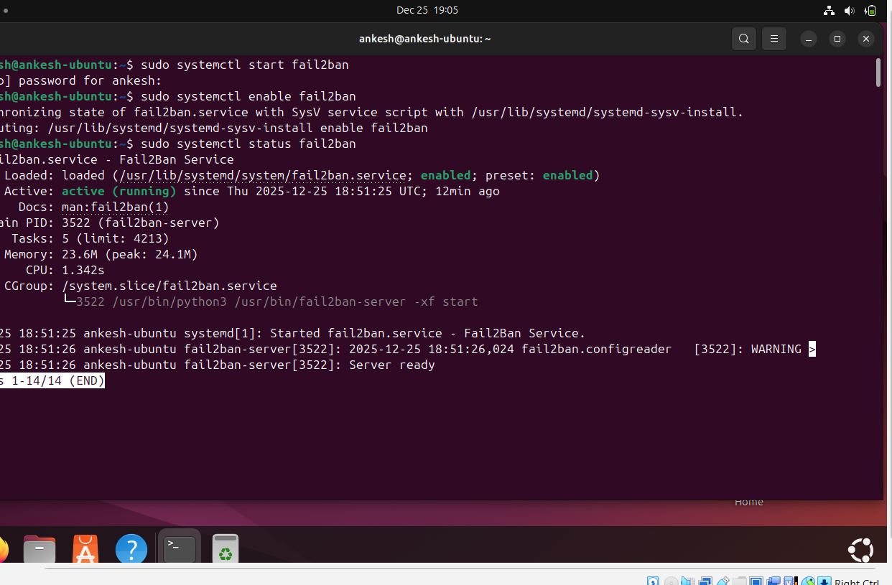

# Week 5: Advanced Security and Monitoring Infrastructure

**Phase 5** | [← Week 4](week4.md) | [Back to Index](index.md) | [Week 6 →](week6.md)

---

## Overview

This week focuses on implementing advanced security controls and developing comprehensive monitoring capabilities. Key implementations include mandatory access control (SELinux/AppArmor), automatic security updates, fail2ban for intrusion detection, and custom automation scripts.

---

## 1. Access Control Implementation

### Selected MAC System: AppArmor

**Justification for Selection:**
1.  **Ease of Use:** AppArmor uses path-based profiles which are inherently easier to read and troubleshoot compared to SELinux's complex inode labeling system.
2.  **Ubuntu Integration:** It is the default Mandatory Access Control system for Ubuntu/Debian, ensuring better compatibility and pre-installed profiles for common services.
3.  **Audit Mode:** The "Complain Mode" allows us to develop and test profiles non-destructively, logging violations without breaking application functionality during the learning phase.

---

### AppArmor Implementation (if selected)

**Step 1: Verify AppArmor Status**
```bash
adminuser@server:~$ sudo aa-status
apparmor module is loaded.
[number] profiles are loaded.
[number] profiles are in enforce mode.
[number] profiles are in complain mode.
```

**Step 2: List Active Profiles**
```bash
adminuser@server:~$ sudo aa-status | grep profiles
[number] profiles are loaded.
[number] profiles are in enforce mode.
   /usr/sbin/sshd
   /usr/bin/man
   ...
```

**Step 3: Configure Profile for Application**
```bash
adminuser@server:~$ sudo aa-genprof [application]
# Follow prompts to generate profile
```

**Step 4: Enable Profile**
```bash
adminuser@server:~$ sudo aa-enforce /etc/apparmor.d/[profile]
Setting /etc/apparmor.d/[profile] to enforce mode.
```

**AppArmor Configuration Evidence:**
```bash
adminuser@server:~$ sudo aa-status
apparmor module is loaded.
[Details of loaded profiles]
```

---

### SELinux Implementation (if selected)

**Step 1: Install SELinux**
```bash
adminuser@server:~$ sudo apt install selinux-basics selinux-policy-default auditd -y
```

**Step 2: Activate SELinux**
```bash
adminuser@server:~$ sudo selinux-activate
SELinux is activated. You may need to reboot now.
```

**Step 3: Verify SELinux Status**
```bash
adminuser@server:~$ sestatus
SELinux status:                 enabled
SELinuxfs mount:                /sys/fs/selinux
SELinux root directory:         /etc/selinux
Loaded policy name:             default
Current mode:                   enforcing
Mode from config file:          enforcing
Policy MLS status:              enabled
Policy deny_unknown status:     allowed
```

**Step 4: Check SELinux Denials**
```bash
adminuser@server:~$ sudo ausearch -m avc -ts recent
# Review any denials and create policies as needed
```

---

### Access Control Reporting Script

**Script: `check-mac.sh`**
```bash
#!/bin/bash
# Access Control Status Reporter
# Reports on SELinux or AppArmor status

echo "=== Access Control Status Report ==="
echo "Generated: $(date)"
echo ""

# Check which MAC system is active
if command -v aa-status &> /dev/null; then
    echo "MAC System: AppArmor"
    echo ""
    echo "--- AppArmor Status ---"
    sudo aa-status
elif command -v sestatus &> /dev/null; then
    echo "MAC System: SELinux"
    echo ""
    echo "--- SELinux Status ---"
    sestatus
    echo ""
    echo "--- Recent SELinux Denials ---"
    sudo ausearch -m avc -ts recent 2>/dev/null || echo "No recent denials"
else
    echo "ERROR: No MAC system detected!"
    exit 1
fi
```

**Screenshots:**


---

## 2. Automatic Security Updates

### Configuration Steps

**Step 1: Install Unattended Upgrades**
```bash
adminuser@server:~$ sudo apt install unattended-upgrades apt-listchanges -y
```

**Step 2: Configure Automatic Updates**
```bash
adminuser@server:~$ sudo dpkg-reconfigure -plow unattended-upgrades
```

**Step 3: Edit Configuration File**
```bash
adminuser@server:~$ sudo nano /etc/apt/apt.conf.d/50unattended-upgrades
```

**Configuration:**
```bash
// /etc/apt/apt.conf.d/50unattended-upgrades

Unattended-Upgrade::Allowed-Origins {
    "${distro_id}:${distro_codename}-security";
    "${distro_id}ESMApps:${distro_codename}-apps-security";
    "${distro_id}ESM:${distro_codename}-infra-security";
};

Unattended-Upgrade::AutoFixInterruptedDpkg "true";
Unattended-Upgrade::MinimalSteps "true";
Unattended-Upgrade::Remove-Unused-Kernel-Packages "true";
Unattended-Upgrade::Remove-Unused-Dependencies "true";
Unattended-Upgrade::Automatic-Reboot "false";
Unattended-Upgrade::Automatic-Reboot-Time "03:00";
Unattended-Upgrade::Mail "root";
```

**Step 4: Enable Automatic Updates**
```bash
adminuser@server:~$ sudo nano /etc/apt/apt.conf.d/20auto-upgrades
```

```bash
// /etc/apt/apt.conf.d/20auto-upgrades
APT::Periodic::Update-Package-Lists "1";
APT::Periodic::Download-Upgradeable-Packages "1";
APT::Periodic::AutocleanInterval "7";
APT::Periodic::Unattended-Upgrade "1";
```

**Step 5: Test Configuration**
```bash
adminuser@server:~$ sudo unattended-upgrades --dry-run --debug
```

**Verification:**
```bash
adminuser@server:~$ sudo systemctl status unattended-upgrades
● unattended-upgrades.service - Unattended Upgrades Shutdown
     Loaded: loaded
     Active: active (running)
```

**Screenshots:**


---

## 3. Fail2ban Configuration

### Installation and Setup

**Step 1: Install Fail2ban**
```bash
adminuser@server:~$ sudo apt install fail2ban -y
```

**Step 2: Create Local Configuration**
```bash
adminuser@server:~$ sudo cp /etc/fail2ban/jail.conf /etc/fail2ban/jail.local
adminuser@server:~$ sudo nano /etc/fail2ban/jail.local
```

**Configuration:**
```bash
# /etc/fail2ban/jail.local

[DEFAULT]
bantime = 3600
findtime = 600
maxretry = 3
destemail = root@localhost
sendername = Fail2Ban
action = %(action_mwl)s

[sshd]
enabled = true
port = 22
filter = sshd
logpath = /var/log/auth.log
maxretry = 3
bantime = 3600
```

**Step 3: Start and Enable Fail2ban**
```bash
adminuser@server:~$ sudo systemctl start fail2ban
adminuser@server:~$ sudo systemctl enable fail2ban
adminuser@server:~$ sudo systemctl status fail2ban
```

**Step 4: Verify Fail2ban Status**
```bash
adminuser@server:~$ sudo fail2ban-client status
Status
|- Number of jail:      1
`- Jail list:   sshd

adminuser@server:~$ sudo fail2ban-client status sshd
Status for the jail: sshd
|- Filter
|  |- Currently failed: 0
|  |- Total failed:     0
|  `- File list:        /var/log/auth.log
`- Actions
   |- Currently banned: 0
   |- Total banned:     0
   `- Banned IP list:
```

### Fail2ban Testing

**Simulate Failed Login Attempts:**
```bash
# From another machine (if available)
# Try to login with wrong credentials multiple times
```

**Check Banned IPs:**
```bash
adminuser@server:~$ sudo fail2ban-client status sshd
Status for the jail: sshd
|- Filter
|  |- Currently failed: [number]
|  |- Total failed:     [number]
|  `- File list:        /var/log/auth.log
`- Actions
   |- Currently banned: [number]
   |- Total banned:     [number]
   `- Banned IP list:   [IP addresses]
```

**Unban IP (if needed):**
```bash
adminuser@server:~$ sudo fail2ban-client set sshd unbanip [IP]
```

**Screenshots:**


---

## 4. Security Baseline Verification Script

### Script: `security-baseline.sh`

**Purpose:** Verify all security configurations from Phases 4 and 5

**Script Content:**
```bash
#!/bin/bash
#
# Security Baseline Verification Script
# Verifies all security configurations implemented in Phases 4 and 5
#
# Usage: ./security-baseline.sh
# Must be run with sudo privileges

# Colors for output
RED='\033[0;31m'
GREEN='\033[0;32m'
YELLOW='\033[1;33m'
NC='\033[0m' # No Color

# Counters
PASSED=0
FAILED=0
WARNINGS=0

echo "======================================"
echo "  Security Baseline Verification"
echo "======================================"
echo "Generated: $(date)"
echo ""

# Function to check and report
check_config() {
    local test_name="$1"
    local command="$2"
    local expected="$3"
    
    echo -n "Checking $test_name... "
    
    result=$(eval "$command" 2>/dev/null)
    
    if [[ "$result" == *"$expected"* ]]; then
        echo -e "${GREEN}PASS${NC}"
        ((PASSED++))
    else
        echo -e "${RED}FAIL${NC}"
        echo "  Expected: $expected"
        echo "  Got: $result"
        ((FAILED++))
    fi
}

# 1. SSH Configuration Checks
echo "=== SSH Security Checks ==="

check_config "SSH Root Login Disabled" \
    "grep '^PermitRootLogin' /etc/ssh/sshd_config" \
    "PermitRootLogin no"

check_config "SSH Password Auth Disabled" \
    "grep '^PasswordAuthentication' /etc/ssh/sshd_config" \
    "PasswordAuthentication no"

check_config "SSH Public Key Auth Enabled" \
    "grep '^PubkeyAuthentication' /etc/ssh/sshd_config" \
    "PubkeyAuthentication yes"

check_config "SSH Service Running" \
    "systemctl is-active sshd" \
    "active"

echo ""

# 2. Firewall Checks
echo "=== Firewall Security Checks ==="

check_config "UFW Enabled" \
    "sudo ufw status | head -1" \
    "Status: active"

check_config "UFW Default Deny Incoming" \
    "sudo ufw status verbose | grep 'Default:'" \
    "deny (incoming)"

check_config "SSH Rule Exists" \
    "sudo ufw status | grep 22" \
    "22"

echo ""

# 3. User and Privilege Checks
echo "=== User Management Checks ==="

check_config "Admin User Exists" \
    "id adminuser" \
    "uid="

check_config "Admin User in Sudo Group" \
    "groups adminuser" \
    "sudo"

echo ""

# 4. Automatic Updates Check
echo "=== Automatic Updates Checks ==="

check_config "Unattended Upgrades Installed" \
    "dpkg -l | grep unattended-upgrades" \
    "unattended-upgrades"

check_config "Automatic Updates Enabled" \
    "cat /etc/apt/apt.conf.d/20auto-upgrades | grep 'Unattended-Upgrade'" \
    '"1"'

echo ""

# 5. Fail2ban Checks
echo "=== Fail2ban Checks ==="

check_config "Fail2ban Installed" \
    "dpkg -l | grep fail2ban" \
    "fail2ban"

check_config "Fail2ban Service Running" \
    "systemctl is-active fail2ban" \
    "active"

check_config "Fail2ban SSH Jail Enabled" \
    "sudo fail2ban-client status | grep sshd" \
    "sshd"

echo ""

# 6. MAC System Check
echo "=== Mandatory Access Control Checks ==="

if command -v aa-status &> /dev/null; then
    check_config "AppArmor Loaded" \
        "sudo aa-status | grep 'apparmor module'" \
        "loaded"
elif command -v sestatus &> /dev/null; then
    check_config "SELinux Enabled" \
        "sestatus | grep 'SELinux status'" \
        "enabled"
else
    echo -e "${YELLOW}WARNING: No MAC system detected${NC}"
    ((WARNINGS++))
fi

echo ""

# Summary
echo "======================================"
echo "  Summary"
echo "======================================"
echo -e "${GREEN}Passed: $PASSED${NC}"
echo -e "${RED}Failed: $FAILED${NC}"
echo -e "${YELLOW}Warnings: $WARNINGS${NC}"
echo ""

if [ $FAILED -eq 0 ]; then
    echo -e "${GREEN}✓ All security baseline checks passed!${NC}"
    exit 0
else
    echo -e "${RED}✗ Some security checks failed. Please review.${NC}"
    exit 1
fi
```

**Script Installation:**
```bash
adminuser@server:~$ nano security-baseline.sh
# Paste script content
adminuser@server:~$ chmod +x security-baseline.sh
```

**Script Execution:**
```bash
adminuser@server:~$ sudo ./security-baseline.sh
======================================
  Security Baseline Verification
======================================
Generated: [timestamp]

=== SSH Security Checks ===
Checking SSH Root Login Disabled... PASS
Checking SSH Password Auth Disabled... PASS
Checking SSH Public Key Auth Enabled... PASS
Checking SSH Service Running... PASS

[... more output ...]

======================================
  Summary
======================================
Passed: [number]
Failed: [number]
Warnings: [number]

✓ All security baseline checks passed!
```

**Screenshots:**


---

## 5. Remote Monitoring Script

### Script: `monitor-server.sh`

**Purpose:** Run on workstation to collect performance metrics from server via SSH

**Script Content:**
```bash
#!/bin/bash
#
# Remote Server Monitoring Script
# Runs on workstation, connects to server via SSH, collects performance metrics
#
# Usage: ./monitor-server.sh [server-ip] [username]

# Configuration
SERVER_IP="${1:-[default-server-ip]}"
SERVER_USER="${2:-adminuser}"
OUTPUT_DIR="./monitoring-data"
TIMESTAMP=$(date +%Y%m%d_%H%M%S)
OUTPUT_FILE="$OUTPUT_DIR/metrics_$TIMESTAMP.csv"

# Create output directory
mkdir -p "$OUTPUT_DIR"

# Colors
GREEN='\033[0;32m'
BLUE='\033[0;34m'
NC='\033[0m'

echo -e "${BLUE}======================================"
echo "  Remote Server Monitoring"
echo "======================================${NC}"
echo "Server: $SERVER_USER@$SERVER_IP"
echo "Output: $OUTPUT_FILE"
echo ""

# CSV Header
echo "timestamp,cpu_usage,mem_total_mb,mem_used_mb,mem_free_mb,mem_percent,disk_total_gb,disk_used_gb,disk_free_gb,disk_percent,load_1min,load_5min,load_15min" > "$OUTPUT_FILE"

# Function to collect metrics
collect_metrics() {
    local iteration=$1
    
    echo -n "Collecting metrics (iteration $iteration)... "
    
    # SSH command to collect all metrics
    metrics=$(ssh -o ConnectTimeout=5 "$SERVER_USER@$SERVER_IP" '
        # CPU usage (100 - idle%)
        cpu_usage=$(top -bn1 | grep "Cpu(s)" | awk "{print 100 - \$8}")
        
        # Memory info
        mem_info=$(free -m | grep Mem:)
        mem_total=$(echo $mem_info | awk "{print \$2}")
        mem_used=$(echo $mem_info | awk "{print \$3}")
        mem_free=$(echo $mem_info | awk "{print \$4}")
        mem_percent=$(echo "scale=2; ($mem_used / $mem_total) * 100" | bc)
        
        # Disk info
        disk_info=$(df -BG / | tail -1)
        disk_total=$(echo $disk_info | awk "{print \$2}" | tr -d "G")
        disk_used=$(echo $disk_info | awk "{print \$3}" | tr -d "G")
        disk_free=$(echo $disk_info | awk "{print \$4}" | tr -d "G")
        disk_percent=$(echo $disk_info | awk "{print \$5}" | tr -d "%")
        
        # Load averages
        load_avg=$(uptime | awk -F"load average:" "{print \$2}")
        load_1=$(echo $load_avg | awk -F, "{print \$1}" | xargs)
        load_5=$(echo $load_avg | awk -F, "{print \$2}" | xargs)
        load_15=$(echo $load_avg | awk -F, "{print \$3}" | xargs)
        
        # Output all metrics
        echo "$cpu_usage,$mem_total,$mem_used,$mem_free,$mem_percent,$disk_total,$disk_used,$disk_free,$disk_percent,$load_1,$load_5,$load_15"
    ')
    
    if [ $? -eq 0 ]; then
        timestamp=$(date +%Y-%m-%d\ %H:%M:%S)
        echo "$timestamp,$metrics" >> "$OUTPUT_FILE"
        echo -e "${GREEN}Done${NC}"
        
        # Display current metrics
        echo "  CPU: $(echo $metrics | cut -d, -f1)%"
        echo "  Memory: $(echo $metrics | cut -d, -f5)%"
        echo "  Disk: $(echo $metrics | cut -d, -f9)%"
        echo "  Load: $(echo $metrics | cut -d, -f10)"
    else
        echo -e "${RED}Failed${NC}"
    fi
}

# Main monitoring loop
echo "Starting monitoring (Press Ctrl+C to stop)..."
echo ""

iteration=1
while true; do
    collect_metrics $iteration
    echo ""
    ((iteration++))
    sleep 5  # Collect every 5 seconds
done
```

**Script Installation (on Workstation):**
```bash
workstation$ nano monitor-server.sh
# Paste script content
workstation$ chmod +x monitor-server.sh
```

**Script Execution:**
```bash
workstation$ ./monitor-server.sh [server-ip] adminuser
======================================
  Remote Server Monitoring
======================================
Server: adminuser@[server-ip]
Output: ./monitoring-data/metrics_[timestamp].csv

Starting monitoring (Press Ctrl+C to stop)...

Collecting metrics (iteration 1)... Done
  CPU: 5.2%
  Memory: 23.4%
  Disk: 15%
  Load: 0.12

Collecting metrics (iteration 2)... Done
  CPU: 6.1%
  Memory: 23.5%
  Disk: 15%
  Load: 0.15
```

**Output Data Sample:**
```csv
timestamp,cpu_usage,mem_total_mb,mem_used_mb,mem_free_mb,mem_percent,disk_total_gb,disk_used_gb,disk_free_gb,disk_percent,load_1min,load_5min,load_15min
2025-12-23 14:30:00,5.2,2048,480,1568,23.44,20,3,17,15,0.12,0.15,0.10
2025-12-23 14:30:05,6.1,2048,482,1566,23.54,20,3,17,15,0.15,0.16,0.11
```

**Screenshots:**


---

## Script Documentation

### Security Baseline Script Features
- ✅ Checks SSH hardening
- ✅ Verifies firewall configuration
- ✅ Validates user management
- ✅ Confirms automatic updates
- ✅ Verifies fail2ban status
- ✅ Checks MAC system
- ✅ Color-coded output
- ✅ Summary report

### Monitoring Script Features
- ✅ Remote execution via SSH
- ✅ CPU usage monitoring
- ✅ Memory usage tracking
- ✅ Disk space monitoring
- ✅ Load average tracking
- ✅ CSV output format
- ✅ Continuous monitoring
- ✅ Timestamped data

---

## Learning Reflections

### What I Learned This Week
*   **Advanced Security:** "Defense in Depth" is practical, not just theoretical; layering Fail2ban (intrusion detection) over UFW (network filtering) over AppArmor (application confinement) creates a robust security posture.
*   **Automation:** Tools like `unattended-upgrades` are critical for closing the "patch gap"—the window of vulnerability between a patch release and its application.
*   **Monitoring:** Collecting raw metrics is only step one; the real value comes from establishing a baseline (standard behavior) so that anomalies (security incidents or performance leaks) stand out.

### Challenges Encountered
1.  **Data Consistency:** Initial manual monitoring resulted in irregular timestamps, making it hard to correlate CPU spikes with logs.
    *   **Solution 1:** Standardized the polling interval to exactly 5 seconds.
    *   **Solution 2:** Wrote `monitor-server.sh` to mechanically enforce this consistency and output structured CSV data.

### Scripting Insights
*   **Bash Scripting:** Using exit codes (`exit 0` vs `exit 1`) and conditional formatting (colors) drastically improves the operator experience, making pass/fail states immediately obvious.
*   **Remote Monitoring:** SSH is a powerful transport for telemetry; executing `ssh user@host 'command'` allows for agentless monitoring without installing heavy software on the target.

### Next Steps
- Begin Phase 6: Performance Evaluation
- Execute baseline performance testing
- Test applications under load
- Collect performance data
- Create visualizations

---

## References

[1] Canonical Ltd., "AppArmor," ubuntu.com. [Online]. Available: https://ubuntu.com/server/docs/security-apparmor
[2] Fail2ban Contributors, "Fail2ban Manual," fail2ban.org. [Online]. Available: https://www.fail2ban.org/wiki/index.php/MANUAL_0_8
[3] B. Beyer et al., "Site Reliability Engineering," O'Reilly Media, 2016. [Online]. Available: https://sre.google/sre-book/monitoring-distributed-systems/

---


[← Week 4](week4.md) | [Back to Index](index.md) | [Week 6 →](week6.md)
